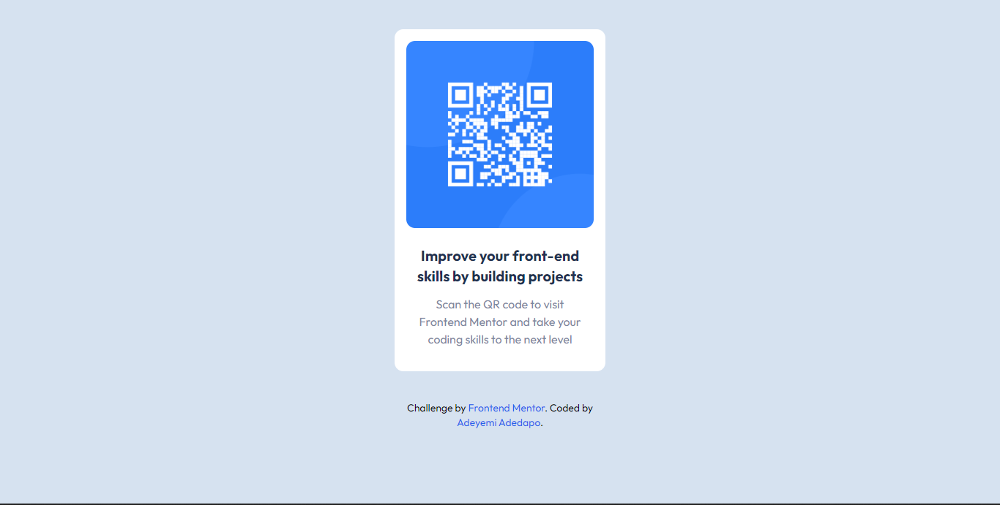

# Frontend Mentor - QR code component solution

This is a solution to the [QR code component challenge on Frontend Mentor](https://www.frontendmentor.io/challenges/qr-code-component-iux_sIO_H). 

## Table of contents

- [Overview](#overview)
  - [Screenshot](#screenshot)
  - [Links](#links)
  - [Built with](#built-with)
  - [What I learned](#what-i-learned)
- [Author](#author)

## Overview

### Screenshot

### Links

- Solution URL: 
- Live Site URL: https://adedapo0x.github.io/Static-QR-Code/

### Built with

- Semantic HTML5 markup
- Tailwind CSS for the UI [https://tailwindcss.com]
- Flexbox
- Mobile-first workflow

### What I learned

Thought I had mastered HTML and CSS, so not getting it perfect at first try was kind of surprising. Maybe it is because I have been too immersed in my JavaScript journey. Knowing the image was not meant to be responsive helped me write lesser code too.

Better mastery of HTML and CSS basically.

## Author

-Adeyemi Adedapo - []
- Frontend Mentor - [@yourusername](https://www.frontendmentor.io/profile/yourusername)

